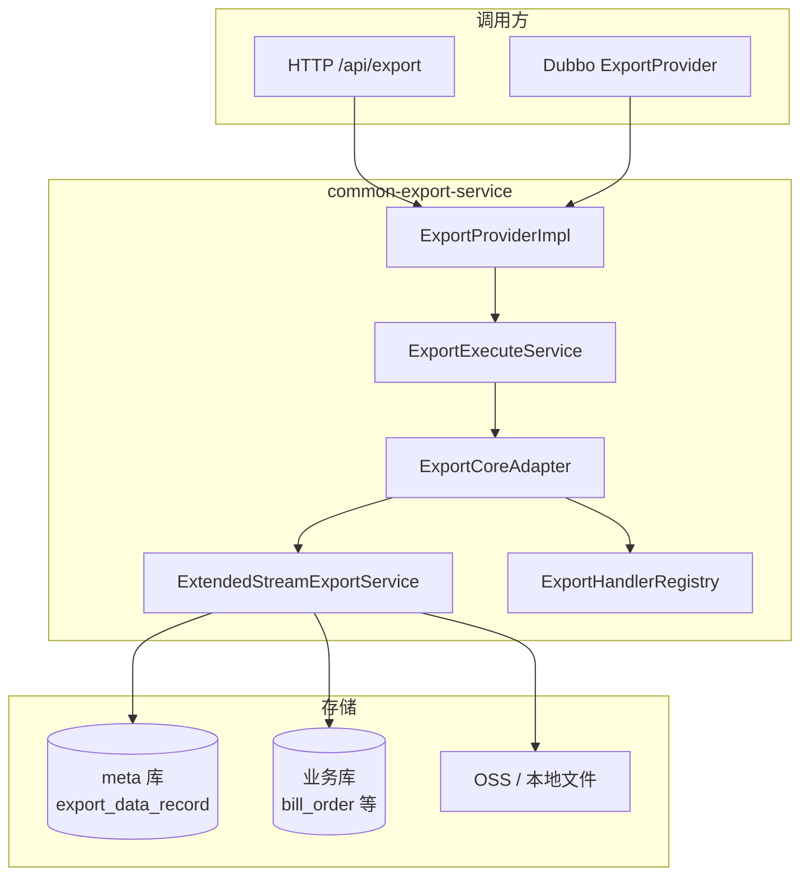

# common-export-parent

公共导出服务，为各业务系统提供统一的异步/同步大数据导出能力。基于流式查询 + XLSX 生成 + 可选 OSS 上传，通过 Dubbo 或 HTTP 对外暴露接口。同步导出按行数分流（阈值 50000，写死）：超过强制异步，未超过可同步完成并直接返回结果。详见 [docs/同步导出方案.md](docs/同步导出方案.md)。

## 模块结构

```
common-export-parent/
├── common-export-stub/          # Dubbo 契约层（业务方依赖）
│   └── cn.sdpjw.export.stub
│       ├── provider/            # ExportProvider 接口
│       ├── dto/                 # 请求/响应 DTO
│       │   └── query/           # 各业务查询 DTO（如 DemoRequestDTO）
│       └── enums/               # MenuEnum 等枚举
│
├── common-export-service/       # 服务实现层
│   └── cn.sdpjw.export
│       ├── provider/            # Dubbo 实现 ExportProviderImpl
│       ├── controller/          # HTTP 调试接口 CommonExportController
│       ├── service/             # 任务编排、记录、校验、并发控制
│       ├── handler/             # 导出 Handler 协议与注册中心
│       │   └── impl/            # 各业务 Handler 实现（如 DemoExportService）
│       ├── core/                # 流式导出核心（原 batch-export-core）
│       │   ├── adapter/         # 业务层与 core 适配 ExportCoreAdapter
│       │   ├── service/         # 流式导出、任务状态、上传
│       │   ├── upload/          # local / oss 上传策略
│       │   └── mapper/          # CSV/XLSX 字段映射
│       ├── dao/                 # meta 库 Mapper（ExportRecordMapper 等）
│       │   └── biz/             # 业务库 Mapper（DemoMapper 等）
│       ├── router/              # 动态数据源路由
│       ├── config/              # 配置、线程池、MyBatis
│       └── recovery/            # 僵死任务扫描与自动重试
│
└── docs/
    ├── sql/export_meta.sql      # 元数据库建表脚本
    ├── 导出核心模块.md           # 核心模块详细设计
    └── 同步导出方案.md           # 同步导出与行数分流方案
```

## 架构概览



### 核心设计原则

| 职责 | 组件 | 数据源 |
|------|------|--------|
| 任务创建、状态、进度、下载地址 | `ExportTaskService`（core） | **meta** |
| 查询条件、断点、重试次数等扩展字段 | `ExportRecordService`（业务层） | **meta** |
| 业务数据流式查询 | 各业务 `Handler` + `biz Mapper` | **业务库**（按 menuCode 路由） |
| 文件生成与上传 | `GenericStreamExportService` | 本地临时目录 → OSS |

> **注意**：`export_data_record` 的所有读写必须在 **meta** 数据源上执行；流式查询仅在业务库上下文中进行，二者不可混用同一连接。

## 任务状态

| code | 枚举 | 说明 |
|------|------|------|
| 0 | PENDING | 待执行 |
| 1 | RUNNING | 执行中 |
| 2 | SUCCESS | 成功 |
| 3 | FAILED | 失败 |
| 4 | CANCELLED | 已取消 |
| 5 | RECOVERABLE | 可恢复（僵死任务标记） |

## 快速开始

### 1. 初始化元数据库

```bash
mysql -u root -p < docs/sql/export_meta.sql
```

### 2. 配置数据源

编辑 `common-export-service/src/main/resources/bootstrap-local.yml`：

```yaml
spring:
  datasource:
    dynamic:
      primary: meta
      datasource:
        meta:           # 元数据库，存放 export_data_record
          url: jdbc:mysql://localhost:3306/export_meta?...
        ds_statistics:  # 业务数据库示例
          url: jdbc:mysql://localhost:3306/your_biz_db?...

export:
  datasource-routing:
    demo: ds_statistics   # menuCode → 业务数据源 key
  stream:
    upload-type: oss        # local / oss
    max-export-rows: 500000
    batch-size: 5000
    zip-enabled: false
  oss:
    endpoint: oss-cn-beijing.aliyuncs.com
    bucket-name: your-bucket
    use-internal: false     # 本地开发 false；阿里云 ECS 内网部署可设 true
    host: https://your-cdn.example.com
```

### 3. 启动服务

```bash
mvn clean package -pl common-export-service -am -DskipTests
java -jar common-export-service/target/common-export-service-*.jar --spring.profiles.active=local
```

### 4. 打开演示页面

浏览器访问：`http://localhost:8020/export-demo.html`（端口以实际配置为准）

---

## Demo 使用说明

项目内置 `demo` 导出类型，用于演示完整链路。相关代码：

| 文件 | 说明 |
|------|------|
| `stub/.../MenuEnum.DEMO` | menuCode = `demo` |
| `stub/.../query/DemoRequestDTO` | 查询参数 DTO |
| `handler/impl/DemoExportService` | Handler 实现 |
| `dao/biz/DemoMapper` | 业务库流式查询 `bill_order` |
| `core/mapper/impl/DemoCsvFieldMapper` | XLSX 列映射 |

### 创建导出任务（HTTP）

**POST** `/api/export/create`（异步，立即返回 taskId）

**POST** `/api/export/createSync`（同步：≤50000 条阻塞至完成；超过则降级异步，见响应 `degraded`）

```json
{
  "userInfo": {
    "employeeId": 1001,
    "employeeName": "张三",
    "subscriberApp": "web-app"
  },
  "menuCode": "demo",
  "clientRequestTime": "2026-07-06T10:00:00",
  "traderCorpId": 1001,
  "startTime": "2026-01-01",
  "endTime": "2026-07-06"
}
```

> 业务查询字段（如 `traderCorpId`）与公共字段写在同一 JSON 中。HTTP 入口会保留原始 JSON 到 `queryParams`，执行时按 `DemoRequestDTO` 反序列化。

**响应示例：**

```json
{
  "code": 200,
  "message": "导出任务创建成功",
  "data": "a1b2c3d4e5f6..."
}
```

### 查询进度

**GET** `/api/export/progress/{taskId}`

```json
{
  "code": 200,
  "data": {
    "taskId": "a1b2c3d4...",
    "status": 2,
    "statusDesc": "成功",
    "progress": 100,
    "processedRows": 1500,
    "totalRows": 1500,
    "exportUrl": "https://dev-static-file.example.com/exports/demo/2026/07/06/demo_export.xlsx"
  }
}
```

### 其他接口

| 方法 | 路径 | 说明 |
|------|------|------|
| POST | `/api/export/records` | 分页查询导出记录 |
| GET | `/api/export/download/{taskId}` | 下载导出文件 |
| POST | `/api/export/cancel/{taskId}` | 取消运行中任务 |
| POST | `/api/export/retry/{taskId}` | 重试失败/可恢复任务 |

### Dubbo 调用（业务方集成）

业务方引入 `common-export-stub` 依赖，注入 `ExportProvider`：

```java
@DubboReference(version = "1.0.0")
private ExportProvider exportProvider;

// 创建任务：Dubbo 场景请直接传具体 Query DTO（如 DemoRequestDTO）
DemoRequestDTO request = new DemoRequestDTO();
request.setMenuCode("demo");
request.setUserInfo(userInfo);
request.setTraderCorpId(1001);
request.setStartTime("2026-01-01");
request.setEndTime("2026-07-06");

String taskId = exportProvider.createExport(request);

// 轮询进度
ExportProgressVO progress = exportProvider.getProgress(taskId);

// 获取下载地址（status=2 时）
String url = exportProvider.getDownloadUrl(taskId);
```

---

## 新增导出类型（以 Demo 为模板）

按以下步骤扩展，每步对应 Demo 中的参考文件：

### 1. stub 层：定义契约

```java
// 1) MenuEnum 增加枚举项
ORDER_EXPORT("order-export", "订单导出", true);

// 2) 新增 Query DTO，继承 ExportRequest
public class OrderExportQuery extends ExportRequest {
    private String startDate;
    private String endDate;
    // ...
}
```

### 2. 配置数据源路由

```yaml
export:
  datasource-routing:
    order-export: ds_order   # menuCode → 数据源 key
```

同时在 `spring.datasource.dynamic.datasource` 下配置 `ds_order` 连接信息。

### 3. service 层：实现 Handler

```java
@Service
public class OrderExportHandler implements ExportHandler<OrderExportQuery> {

    @Override public String menuCode() { return MenuEnum.ORDER_EXPORT.getMenuCode(); }
    @Override public Class<OrderExportQuery> queryType() { return OrderExportQuery.class; }
    @Override public String fileNamePrefix(OrderExportQuery req) { return "order_export"; }
    @Override public String remotePath(OrderExportQuery req) { return "exports/order"; }

    @Override
    public CountProvider countProvider(OrderExportQuery req, ExportCheckpoint cp) {
        return () -> orderMapper.countByCondition(req);
    }

    @Override
    public Consumer<ResultHandler<?>> streamProvider(OrderExportQuery req, ExportCheckpoint cp) {
        return handler -> orderMapper.selectStream(req, (ResultHandler<Order>) handler);
    }

    @Override
    public CsvFieldMapper<?> fieldMapper() { return orderFieldMapper; }
}
```

### 4. 业务 Mapper：流式查询

```java
@Mapper
public interface OrderMapper extends BaseMapper<Order> {

    @Select("SELECT ... FROM t_order WHERE ...")
    @Options(fetchSize = Integer.MIN_VALUE)   // MySQL 流式游标，必须配置
    @ResultType(Order.class)
    void selectStream(@Param("query") OrderExportQuery query, ResultHandler<Order> handler);

    @Select("SELECT COUNT(*) FROM t_order WHERE ...")
    long countByCondition(@Param("query") OrderExportQuery query);
}
```

### 5. 字段映射器

实现 `CsvFieldMapper<Order>`，定义表头与行数据转换逻辑（参考 `DemoCsvFieldMapper`）。

### 6. 验证

1. 启动服务，确认日志出现 `注册导出 Handler: menuCode=order-export`
2. 调用 `/api/export/create` 提交任务
3. 轮询 `/api/export/progress/{taskId}` 直至 `status=2`
4. 通过 `exportUrl` 或 `/api/export/download/{taskId}` 获取文件

---

## 配置说明

| 配置项 | 说明 | 示例 |
|--------|------|------|
| `export.datasource-routing` | menuCode 到业务数据源映射 | `demo: ds_statistics` |
| `export.stream.upload-type` | 上传方式 | `oss` / `local` |
| `export.stream.max-export-rows` | 导出行数上限 | `500000` |
| `export.stream.batch-size` | 流式写入批次大小 | `5000` |
| `export.stream.zip-enabled` | 是否打包 ZIP | `false` |
| `export.oss.endpoint` | OSS 公网区域地址 | `oss-cn-beijing.aliyuncs.com` |
| `export.oss.internal` | OSS 内网地址（ECS 部署用） | `oss-cn-beijing-internal.aliyuncs.com` |
| `export.oss.use-internal` | 是否使用内网 endpoint | 本地 `false`，ECS `true` |
| `export.oss.host` | 返回给外部的自定义域名 | CDN 地址 |
| `export.limit.max-concurrent-exports` | 最大并发导出数 | `3` |
| `export.limit.max-retry` | 自动恢复最大重试次数 | `3` |

---